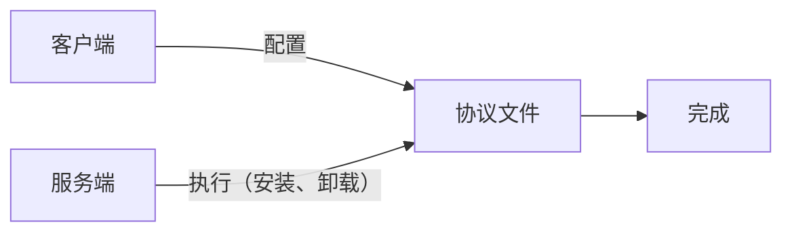

# 游戏模组协议 v1.0.0

客户端生成协议文件、服务端根据协议执行相应的方法

```json
[
  {
    "method": "<方法名>",
    "params": "<请求参数>"
  }
]
```



## 已定义的协议方法

- 游戏启动命令附加参数

```json
{
  "method": "launcher_arg",
  "params": [
    "xxx"
  ]
}

```

- 复制文件 (已过时，仅用于兼容旧数据)

```json
{
  "method": "copy_file",
  "v": "1.0",
  "params": [
    {
      "input": "b1/xxx.json",
      "output": "{{GameRootDir}}/b1/xxx.json"
    },
    {
      "input": "b1/xxxx.pak",
      "output": "{{HomeDir}}/xxxx.pak"
    }
  ]
}
```

- 复制到游戏根目录

```json
 {
  "method": "copy_to_game_dir",
  "params": [
    "xxx.pak"
  ]
}
```

- 复制到系统用户根目录

```json
 {
  "method": "copy_to_home_dir",
  "params": [
    "xxx.pak"
  ]
}
```